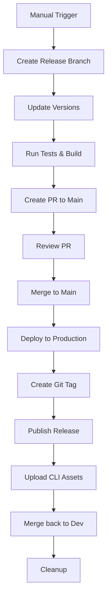

# 🚀 Release Guide

This document describes the automated release process for the zxcv project.

## 🎯 How to Create a Release

### 1. Trigger Release Workflow

1. Go to **Actions** tab in GitHub
2. Select **"Prepare Release"** workflow  
3. Click **"Run workflow"**
4. Fill in the parameters:
   - **Version**: `v1.2.0` (semantic versioning)
   - **Release Type**: `patch`, `minor`, or `major`
   - **Include CLI**: Check if CLI should be included in this release

### 2. Automated Process

The system will automatically:

✅ **Create Release Branch**: `release/v1.2.0`
✅ **Update Versions**: Bump package.json files
✅ **Run Tests**: Ensure code quality
✅ **Build Applications**: Verify builds work
✅ **Generate Changelog**: Based on git commits
✅ **Create PR to Main**: Ready for review
✅ **Create Draft Release**: On GitHub

### 3. Review and Merge

1. **Review the PR**: Check changes and version updates
2. **Approve and Merge**: Merge the PR to `main` branch
3. **Production Deploy**: Automatic deployment to production
4. **Release Finalization**: Tags, assets, and cleanup

## 🔄 Complete Release Flow



## 📦 Release Contents

### Server Application
- Nuxt.js web application
- oRPC API backend  
- Automatically deployed to production

### CLI Tool (Optional)
- Bun-based CLI application
- Cross-platform binaries
- Uploaded as GitHub release assets

## 🏷️ Version Management

We follow [Semantic Versioning (SemVer)](https://semver.org/):

- **MAJOR** (`1.0.0`): Breaking changes
- **MINOR** (`0.1.0`): New features (backwards compatible)
- **PATCH** (`0.0.1`): Bug fixes (backwards compatible)

## 🌍 Deployment Environments

- **Staging**: `dev` branch → https://zxcv-staging.mattyatea.me
- **Production**: `main` branch → https://zxcv.nanasi-apps.xyz

## 🔧 Post-Release Actions

The system automatically:

1. **Creates Git Tags**: For version tracking
2. **Publishes GitHub Release**: From draft to public
3. **Uploads CLI Assets**: If CLI is included
4. **Merges Back to Dev**: Keeps branches synchronized
5. **Cleans Up**: Removes temporary release branches

## ⚠️ Important Notes

### Pre-Release Checks
- All tests must pass ✅
- Builds must succeed ✅  
- No lint errors ❌

### Manual Steps Required
- Review and approve the PR
- Verify deployment works correctly
- Test critical functionality

### Rollback Process
If issues are found:
1. Revert the merge commit on `main`
2. Redeploy previous version
3. Delete problematic git tag
4. Mark GitHub release as pre-release

## 🛠️ Customization

### Adding Release Steps
Edit `.github/workflows/release.yml` to add custom steps:
- Database migrations
- Cache invalidation  
- Notification sending

### CLI Release Assets
CLI builds are handled in `.github/workflows/post-release.yml`:
- Cross-platform compilation
- Asset upload to GitHub releases
- Checksum generation

## 📝 Changelog Generation

Changelogs are automatically generated from:
- Git commit messages
- PR titles and descriptions
- Closed issues between releases

Use conventional commits for better changelog:
```
feat: add user profile page
fix: resolve authentication issue  
docs: update API documentation
```

## 🚨 Troubleshooting

### Release Workflow Fails
- Check workflow logs in Actions tab
- Verify all required secrets are set
- Ensure branch permissions allow PR creation

### Deployment Issues
- Monitor Cloudflare Workers deployment
- Check production site accessibility
- Review error logs

### CLI Build Problems
- Verify Bun installation in CI
- Check cross-compilation settings
- Validate binary permissions

---

For questions or issues with releases, please create an issue in the repository.